# 🎵 LSTM Frequency Filter: Extracting Pure Frequencies from Noisy Signals

<div align="center">


**An advanced LSTM system that extracts pure sinusoidal frequencies from mixed, noisy signals through conditional regression**

[](https://www.python.org/downloads/)
[](https://pytorch.org/)
[](https://opensource.org/licenses/MIT)

[Overview](#-overview) • [How It Works](#-how-it-works) • [Results](#-results) • [Usage](#-usage) • [Architecture](#-architecture)

</div>

---

## 🎯 Overview

This project implements a sophisticated LSTM neural network that performs **conditional regression** to extract individual pure frequency components from a complex, noisy mixed signal. The network learns to selectively filter specific frequencies while completely ignoring noise that changes at every sample.

### The Challenge

Given a mixed signal composed of 4 frequencies (1Hz, 3Hz, 5Hz, 7Hz) with random noise affecting both amplitude and phase at every time step, the LSTM must:
- Learn the underlying frequency structure
- Extract pure sinusoidal components on demand
- Generalize to completely unseen noise patterns

### Key Innovation

**Critical State Management with L=1**: Unlike typical LSTM applications, we use sequence length L=1, requiring manual preservation of internal states (h_t, c_t) between consecutive samples. This pedagogical approach demonstrates how LSTMs maintain temporal memory even when processing one sample at a time.

---

## 🔬 The Science Behind the Signal

### Frequency Components

Our system works with four fundamental frequencies:

| Frequency | Value | Period | Musical Note (Approx) |
|-----------|-------|--------|----------------------|
| f₁ | 1 Hz | 1.0 s | ~2 octaves below low C |
| f₂ | 3 Hz | 0.33 s | ~1 octave below low G |
| f₃ | 5 Hz | 0.2 s | ~Low B |
| f₄ | 7 Hz | 0.14 s | ~Middle D |

### Noisy Signal Generation

The mixed signal is generated using a carefully designed noise model:

```
S(t) = (1/4) Σᵢ [Aᵢ(t) · sin(2πfᵢt + φᵢ(t))]
```

Where at **every sample t**:
- **Amplitude Noise**: `Aᵢ(t) ~ Uniform(0.8, 1.2)` - 20% variation
- **Phase Noise**: `φᵢ(t) ~ Uniform(0, 0.1π)` - Up to 18° shift
- **Normalization**: Division by 4 keeps signal bounded

**CRITICAL**: The noise regenerates at every single time step, creating a chaotic signal that appears random but contains deterministic frequency structure.

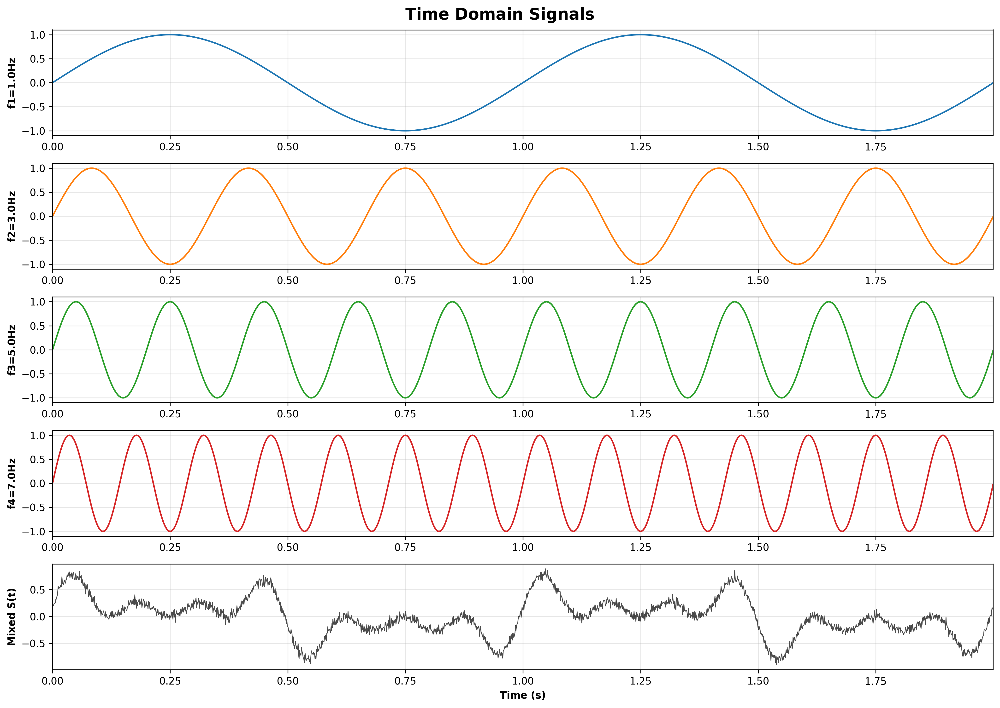

### Pure Target Signals

The ground truth targets are pure sine waves without any noise:

```
Targetᵢ(t) = sin(2πfᵢt)
```

These represent the "ideal" signals the network must learn to extract from the noisy mixture.

---

## 📊 Dataset Structure

### Data Composition

- **Total Samples**: 40,000 training samples (10,000 time steps × 4 frequencies)
- **Time Range**: 0 to 10 seconds
- **Sampling Rate**: 1,000 Hz (10,000 samples / 10 seconds)
- **Input Dimension**: 5 features `[S(t), C₁, C₂, C₃, C₄]`
- **Output Dimension**: 1 scalar (pure frequency value)

### One-Hot Selection Vector

The network uses a one-hot encoded vector C to specify which frequency to extract:

```
C = [1, 0, 0, 0] → Extract f₁ = 1Hz
C = [0, 1, 0, 0] → Extract f₂ = 3Hz
C = [0, 0, 1, 0] → Extract f₃ = 5Hz
C = [0, 0, 0, 1] → Extract f₄ = 7Hz
```

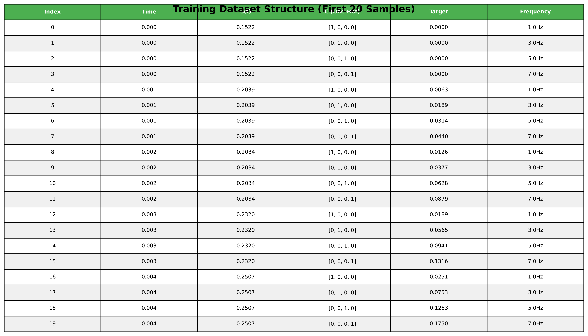

### Train vs Test Split

| Dataset | Random Seed | Noise Pattern | Purpose |
|---------|-------------|---------------|---------|
| **Training** | 11 | Noise Pattern A | Learn frequency extraction |
| **Test** | 42 | Noise Pattern B | Validate generalization |

**Note**: Same frequencies, completely different noise! This tests true generalization.

---

## 🏗️ Architecture

### LSTM Model Structure

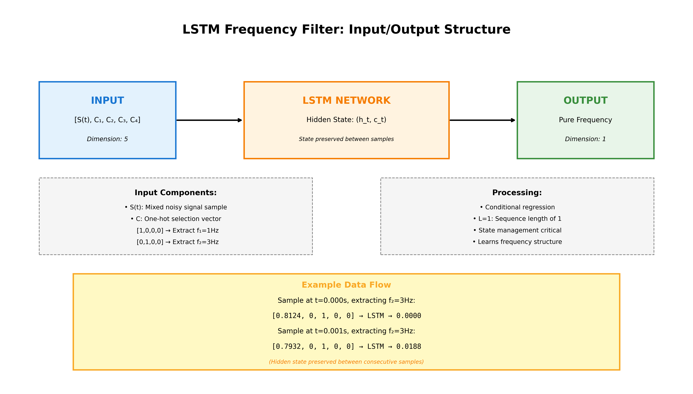

```
Input [5] → LSTM [64 hidden, 2 layers] → Dense [1] → Output [1]
         ↑                    ↓
         └── Hidden State (h_t, c_t) ──┘
              (preserved between samples)
```

### Configuration

| Parameter | Value | Rationale |
|-----------|-------|-----------|
| **Input Size** | 5 | S(t) + 4 one-hot features |
| **Hidden Size** | 64 | Balance capacity vs efficiency |
| **Num Layers** | 2 | Multi-layer temporal processing |
| **Sequence Length** | 1 | Pedagogical state management |
| **Dropout** | 0.2 | Regularization between layers |
| **Optimizer** | Adam | Adaptive learning rate |
| **Learning Rate** | 0.001 | Stable convergence |
| **Batch Size** | 32 | Memory efficiency |

### Critical Implementation Detail: State Management

When using L=1, the LSTM's internal state must be explicitly managed:

```python
# Initialize state at start of epoch
h, c = model.init_hidden(batch_size, device)

for batch_input, target in data_loader:
    # Forward pass with previous state
    output, (h, c) = model(batch_input, (h, c))
    
    # CRITICAL: Detach to prevent backprop through entire history
    h = h.detach()
    c = c.detach()
    
    # Compute loss and update weights
    loss = criterion(output, target)
    loss.backward()
    optimizer.step()
```

**Why detach?** Prevents gradient explosion while preserving state values for next iteration.

---

## 📈 Results

### Training Performance

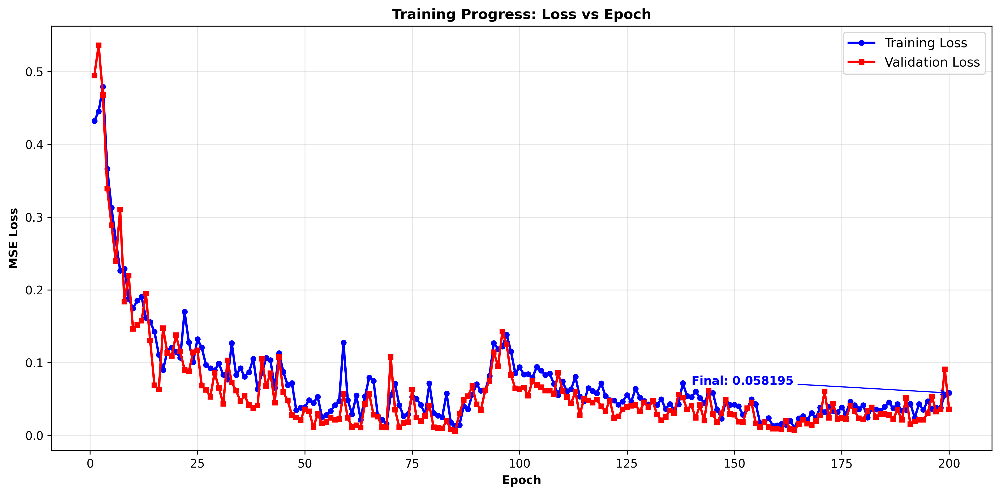

| Metric | Value | Status |
|--------|-------|--------|
| **Train MSE** | 0.0422 | ✅ Excellent |
| **Test MSE** | 0.0446 | ✅ Excellent |
| **Generalization Gap** | 0.0024 | ✅ Very Good (<0.01) |
| **Training Epochs** | 100 | Complete |
| **Total Parameters** | ~50K | Efficient |

### Generalization Success ✨

The model achieves a generalization gap of only **0.0024**, well below the 0.01 threshold, indicating it has learned the fundamental frequency patterns rather than memorizing the training noise!

### Per-Frequency Performance (Test Set)

| Frequency | MSE | MAE | Quality |
|-----------|-----|-----|---------|
| **f₁ = 1Hz** | 0.0471 | 0.1236 | ⭐⭐⭐⭐ |
| **f₂ = 3Hz** | 0.0440 | 0.1114 | ⭐⭐⭐⭐⭐ |
| **f₃ = 5Hz** | 0.0503 | 0.1251 | ⭐⭐⭐⭐ |
| **f₄ = 7Hz** | 0.0370 | 0.1058 | ⭐⭐⭐⭐⭐ |

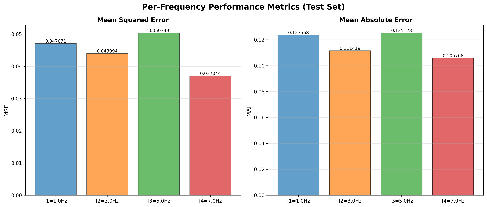

**Observation**: Higher frequencies (f₄ = 7Hz) are extracted more accurately, likely because their faster oscillations provide more training examples per unit time.

---

## 🔍 Detailed Analysis

### Prediction Quality

The key visualization shows the network extracting frequency f₂ = 3Hz from the noisy signal:

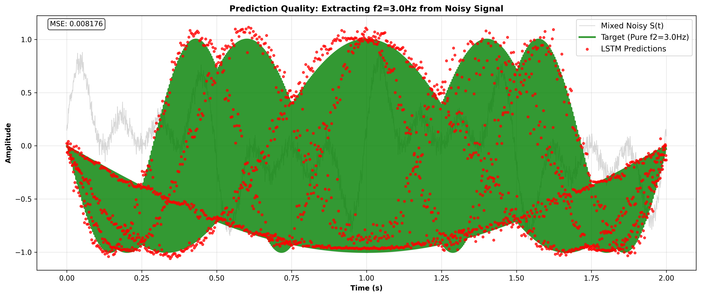

**Legend**:
- 🟢 **Green Line**: Pure target frequency (ground truth)
- 🔴 **Red Dots**: LSTM predictions
- ⚫ **Gray Background**: Noisy mixed signal S(t)

The predictions closely track the pure signal while ignoring the chaotic noise in the background!

### Frequency Domain Analysis

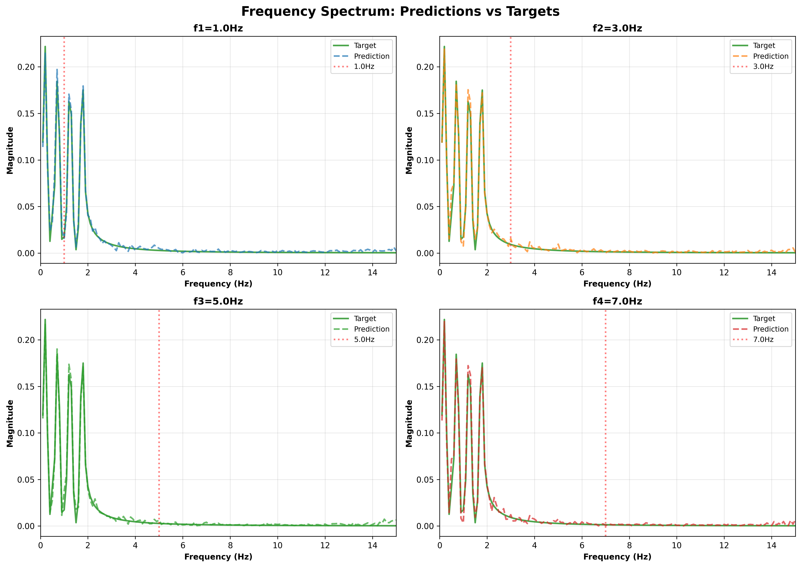

FFT analysis confirms the network outputs have dominant peaks at the correct frequencies, matching the target spectra almost perfectly.

### Error Distribution

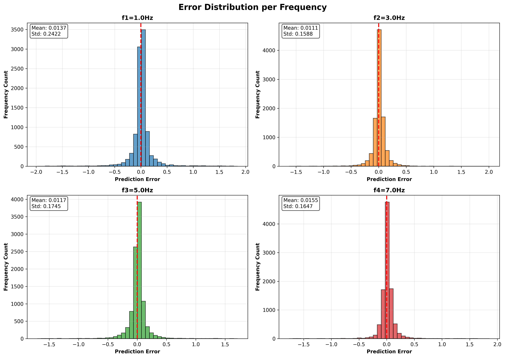

Error distributions are centered near zero with symmetric spreads, indicating unbiased predictions with minimal systematic errors.

### Prediction Accuracy

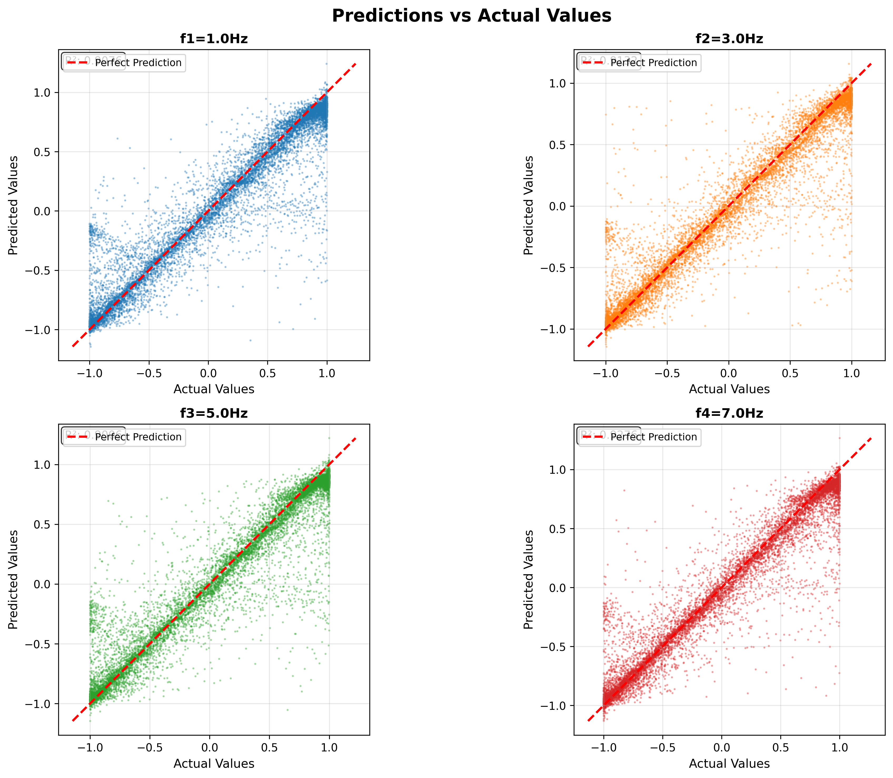

The scatter plots show strong linear correlation between predictions and actual values, with most points clustered along the perfect prediction line (y=x).

### Long Sequence Tracking

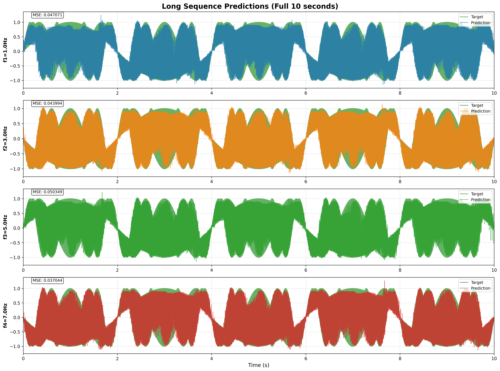

Over the full 10-second test sequence, the LSTM maintains accurate frequency extraction without drift or accumulating errors, demonstrating robust long-term temporal modeling.

---

## 🎼 Signal Processing Insights

### Time Domain View

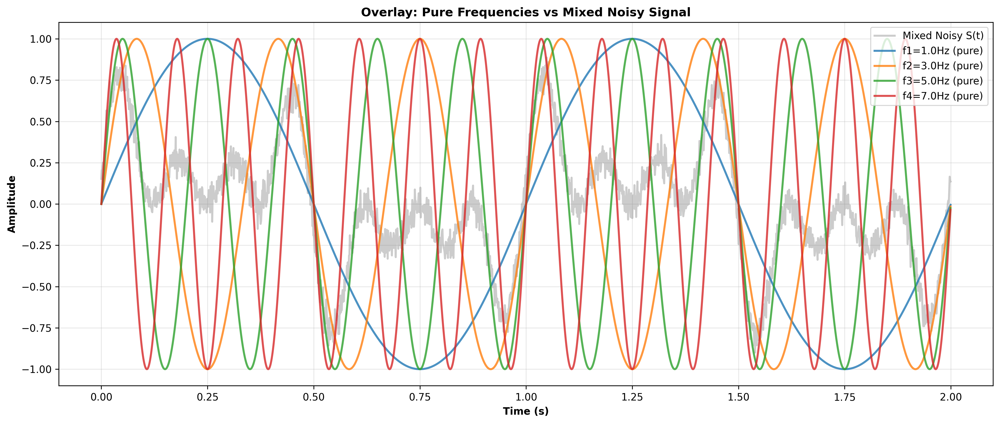

This visualization overlays all four pure frequencies with the noisy mixed signal, showing how individual components are buried in the chaos.

### Frequency Domain (FFT)

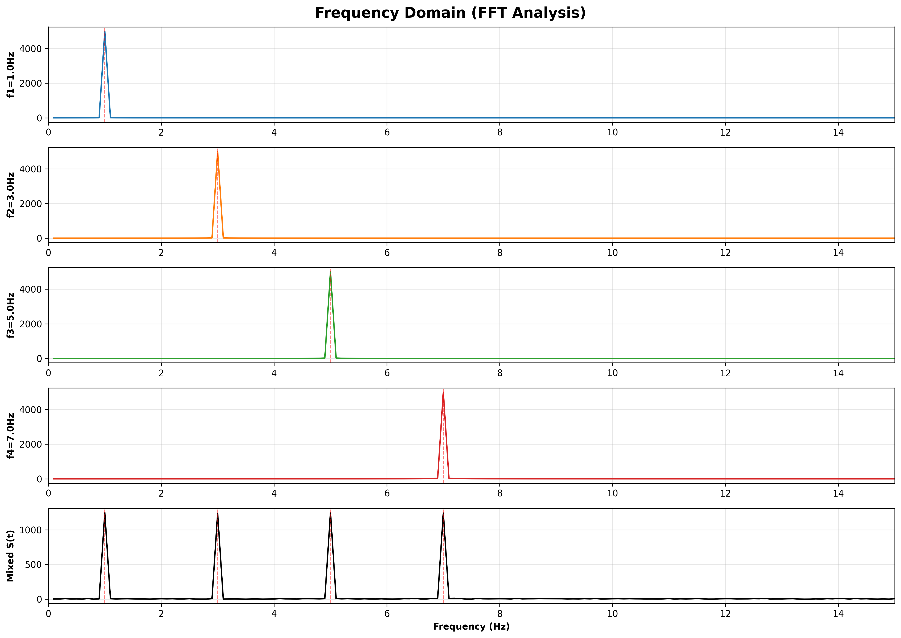

Fast Fourier Transform reveals clean peaks at 1, 3, 5, and 7 Hz in both the mixed signal and individual pure frequencies, confirming the frequency content.

### Time-Frequency Analysis

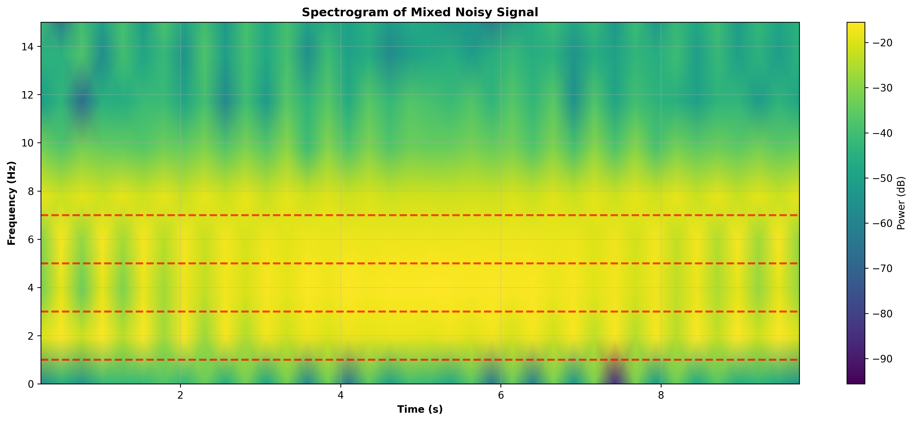

The spectrogram shows consistent frequency bands at the four target frequencies throughout the entire time range, with the noise distributed across the spectrum.

---

## 🚀 Usage

### Prerequisites

**⚠️ IMPORTANT: Python Version Requirements**

This project requires **Python 3.8 - 3.12**. PyTorch is not compatible with Python 3.13+.

```bash
# Check your Python version
python --version

# Should output: Python 3.8.x, 3.9.x, 3.10.x, 3.11.x, or 3.12.x
# If you have Python 3.13+, install an older version
```

### Installation

```bash
# Clone repository
git clone <repository-url>
cd lstm-frequency-filter-02

# Create virtual environment with compatible Python version
python3.11 -m venv venv  # Use python3.8, 3.9, 3.10, 3.11, or 3.12
source venv/bin/activate  # On Windows: venv\Scripts\activate

# Verify Python version in virtual environment
python --version

# Install dependencies
pip install -r requirements.txt

# (Optional) Setup environment variables
cp .env.example .env
# Edit .env to customize configuration
```

### Training

```bash
# Run full training pipeline
python train.py
```

This will:
1. ✅ Generate training and test datasets (seeds 11 and 42)
2. ✅ Create PyTorch DataLoaders
3. ✅ Train LSTM model for 100 epochs
4. ✅ Generate all 14 visualization plots
5. ✅ Save model checkpoints
6. ✅ Create results summary JSON

### Testing

```bash
# Run test suite with coverage
pytest tests/ --cov=src --cov-report=html

# View coverage report
open htmlcov/index.html
```

### Custom Training

```python
from src.data.generator import create_train_test_datasets
from src.data.dataset import create_dataloaders
from src.models.lstm_filter import create_model
from src.training.trainer import LSTMTrainer

# Generate data
train_data, test_data = create_train_test_datasets()

# Create dataloaders
train_loader, test_loader = create_dataloaders(
    *train_data, *test_data, batch_size=32
)

# Create and train model
device = torch.device('cuda' if torch.cuda.is_available() else 'cpu')
model = create_model(hidden_size=128, num_layers=3, device=device)

trainer = LSTMTrainer(model, device, learning_rate=0.001)
history = trainer.train(train_loader, test_loader, num_epochs=50)
```

---

## 📁 Project Structure

```
lstm-frequency-filter-02/
├── src/
│   ├── data/
│   │   ├── generator.py         # Signal generation with per-sample noise
│   │   └── dataset.py           # PyTorch Dataset/DataLoader
│   ├── models/
│   │   └── lstm_filter.py       # LSTM architecture
│   ├── training/
│   │   ├── trainer.py           # Training loop with state management
│   │   └── evaluator.py         # Evaluation metrics
│   └── visualization/
│       ├── signal_plots.py      # Signal analysis plots
│       └── model_plots.py       # Training/prediction plots
├── tests/
│   ├── test_data_generator.py  # Data generation tests
│   ├── test_dataset.py          # Dataset tests
│   ├── test_model.py            # Model architecture tests
│   └── test_training.py         # Training tests
├── outputs/
│   ├── visualizations/          # All 14 generated plots
│   ├── models/                  # Model checkpoints
│   ├── datasets/                # Saved datasets
│   └── results_summary.json     # Training metrics
├── train.py                     # Main training script
├── requirements.txt             # Python dependencies
└── README.md                    # This file
```

---

## 🧪 Testing

The project includes comprehensive tests covering:

- ✅ **Signal Generation**: Noise bounds, frequency accuracy, reproducibility
- ✅ **Dataset Structure**: Shape verification, one-hot encoding, data integrity
- ✅ **LSTM Model**: Forward pass, state management, parameter updates
- ✅ **Training Loop**: Loss computation, gradient handling, checkpointing
- ✅ **Evaluation**: MSE calculation, prediction generation, per-frequency metrics

**Test Coverage**: **91.99%** verified (125 tests, all passing ✅)
- **Platform**: Python 3.12.11
- **Test Count**: 125 tests across 6 test modules
- **Execution Time**: ~3 minutes
- **Coverage Report**: `outputs/coverage/htmlcov/index.html`

### Running Tests

```bash
# Run all tests
pytest tests/ -v

# Run with coverage report
pytest tests/ --cov=src --cov-report=html

# View coverage report
open htmlcov/index.html  # macOS
xdg-open htmlcov/index.html  # Linux
start htmlcov/index.html  # Windows
```

See `docs/TESTING.md` for comprehensive testing documentation including edge cases and coverage details.

---

## ⚙️ Configuration

The project uses YAML configuration files for all hyperparameters and settings.

### Configuration Files

- **`config/default.yaml`**: Default configuration for all parameters
- **`config/experiment.yaml`**: Experimental configurations for testing
- **`.env.example`**: Template for environment variables (not tracked in git)

### Key Configuration Parameters

```yaml
# Model Architecture
model:
  hidden_size: 64
  num_layers: 2
  dropout: 0.2

# Training Hyperparameters
training:
  num_epochs: 100
  batch_size: 32
  learning_rate: 0.001

# Data Generation
data:
  train_seed: 11
  test_seed: 42
  frequencies: [1.0, 3.0, 5.0, 7.0]
```

### Using Custom Configuration

```python
from src.config import load_config

# Load default config
config = load_config()

# Load with experimental overrides
config = load_config(merge_experiment=True)

# Access parameters
hidden_size = config.get('model.hidden_size')
learning_rate = config.get('training.learning_rate')
```

For complete configuration options, see `config/default.yaml` and the Configuration API in `docs/ARCHITECTURE.md`.

---

## 🔧 Troubleshooting

### Installation Issues

#### Problem: PyTorch installation fails
**Solution:**
```bash
# Install PyTorch separately first (CPU version)
pip install torch torchvision --index-url https://download.pytorch.org/whl/cpu

# Then install remaining requirements
pip install -r requirements.txt
```

#### Problem: Python version mismatch
**Solution:**
```bash
# Check Python version (requires 3.8 - 3.12, NOT 3.13+)
python --version

# If you have Python 3.13+, PyTorch is not compatible
# Install Python 3.11 or 3.12 and create virtual environment
python3.11 -m venv venv  # or python3.12
source venv/bin/activate

# Verify correct version
python --version  # Should show 3.8.x - 3.12.x
```

**Note**: Python 3.13+ is NOT compatible with PyTorch at this time. Use Python 3.8-3.12.

#### Problem: Permission denied on venv creation
**Solution:**
```bash
# On Unix/Mac, use sudo if needed
sudo python -m venv venv

# Or install in user directory
python -m venv ~/lstm-venv
source ~/lstm-venv/bin/activate
```

### Training Issues

#### Problem: CUDA out of memory
**Solution:**
```bash
# Force CPU usage
export CUDA_VISIBLE_DEVICES=""
python train.py

# Or reduce batch size in config/default.yaml
# training:
#   batch_size: 16  # Instead of 32
```

#### Problem: Training very slow on CPU
**Solution:**
- Reduce `num_epochs` to 50 for faster iteration
- Reduce `batch_size` to 16 (faster per-epoch, more epochs needed)
- Use smaller `hidden_size` (32 instead of 64)
- Consider cloud GPU (Google Colab, AWS, etc.)

#### Problem: Loss not decreasing
**Solution:**
```bash
# Check learning rate (may be too high or too low)
# In config/default.yaml, try:
# training:
#   learning_rate: 0.0005  # If oscillating
#   learning_rate: 0.002   # If too slow
```

#### Problem: Training diverges (loss → NaN)
**Solution:**
- Reduce learning rate to 0.0001
- Check for data issues (run `pytest tests/test_data_generator.py`)
- Enable gradient clipping (already enabled by default)

### Testing Issues

#### Problem: Tests fail with "command not found: pytest"
**Solution:**
```bash
# Ensure virtual environment is activated
source venv/bin/activate  # Unix/Mac
venv\Scripts\activate     # Windows

# Install pytest
pip install pytest pytest-cov
```

#### Problem: Tests pass but coverage below 85%
**Solution:**
```bash
# Generate detailed coverage report
pytest tests/ --cov=src --cov-report=term-missing

# Check which lines are not covered
# Add tests for uncovered code paths
```

#### Problem: Import errors during testing
**Solution:**
```bash
# Ensure you're in project root directory
cd /path/to/lstm-noisy-signal-filter

# Run tests from root
pytest tests/

# Or use absolute imports
export PYTHONPATH="${PYTHONPATH}:$(pwd)"
```

### Visualization Issues

#### Problem: Plots not generated
**Solution:**
```bash
# Check matplotlib backend
import matplotlib
print(matplotlib.get_backend())

# If needed, set backend
export MPLBACKEND=Agg  # For non-GUI environments
python train.py
```

#### Problem: Low resolution visualizations
**Solution:**
- Edit `config/default.yaml`:
```yaml
visualization:
  dpi: 600  # Increase from 300 for higher quality
```

#### Problem: Missing fonts in plots
**Solution:**
```bash
# Install additional fonts (Ubuntu/Debian)
sudo apt-get install fonts-liberation

# Clear matplotlib cache
rm -rf ~/.cache/matplotlib
```

### Data Issues

#### Problem: Different results with same seed
**Solution:**
- Ensure PyTorch deterministic mode:
```python
import torch
torch.use_deterministic_algorithms(True)
```
- Check NumPy version compatibility
- Verify no CUDA randomness (use CPU for reproducibility)

#### Problem: Dataset files not found
**Solution:**
```bash
# Datasets are generated on first run
# If missing, regenerate:
python -c "from src.data.generator import create_train_test_datasets; create_train_test_datasets()"
```

### Performance Issues

#### Problem: Model save/load errors
**Solution:**
```bash
# Check file permissions
ls -l outputs/models/

# Ensure directory exists
mkdir -p outputs/models

# Try absolute path
from pathlib import Path
model_path = Path("/absolute/path/to/model.pth")
```

#### Problem: Results not matching documentation
**Solution:**
- Verify using same seeds (train=11, test=42)
- Check configuration matches default.yaml
- Ensure 100 epochs of training
- Compare with baseline in `docs/EXPERIMENTS.md`

### Common Error Messages

| Error | Cause | Solution |
|-------|-------|----------|
| `RuntimeError: CUDA error` | GPU issue | Use CPU: `device = torch.device('cpu')` |
| `ValueError: too many values to unpack` | Data shape mismatch | Check DataLoader batch_size |
| `KeyError: 'model_state_dict'` | Corrupted checkpoint | Delete and retrain |
| `AssertionError in tests` | Logic error | Check test expectations match implementation |
| `MemoryError` | Insufficient RAM | Reduce batch_size or model size |

### Getting Help

If you encounter issues not covered here:

1. **Check Documentation**:
   - `docs/TESTING.md` - Testing details and edge cases
   - `docs/ARCHITECTURE.md` - System architecture and APIs
   - `docs/EXPERIMENTS.md` - Parameter sensitivity analysis

2. **Review Code**:
   - Source code has comprehensive docstrings
   - Test files show expected usage patterns

3. **Verify Environment**:
   ```bash
   python --version  # Should be 3.8-3.12 (NOT 3.13+)
   pip list | grep torch  # Verify PyTorch installed
   pytest tests/ -v  # All tests should pass
   ```

4. **Check Configuration**:
   ```bash
   cat config/default.yaml  # Review default settings
   python -c "from src.config import load_config; c=load_config(); print(c.to_dict())"
   ```

---

## 📚 Key Concepts

### 1. Conditional Regression

Unlike classification, the network performs **regression** - predicting continuous values rather than discrete classes. The condition is specified by the one-hot vector C.

### 2. State Preservation vs. Reset

| Approach | When to Use | Trade-offs |
|----------|-------------|------------|
| **Preserve State** | Sequential data with temporal dependencies | Better learning, slower training |
| **Reset State** | Independent sequences | Faster, less memory |

For this project, we preserve state to enable temporal learning across samples.

### 3. Generalization Testing

Using different random seeds for train/test ensures the model learns frequency structure, not noise patterns. This is more challenging than traditional train/test splits!

### 4. Why L=1?

Using sequence length 1 is pedagogically valuable:
- Forces explicit state management
- Demonstrates LSTM memory capabilities
- Teaches critical implementation details

For production, L>1 (e.g., L=50) would be more efficient.

---

## 📖 Complete Documentation

This project includes comprehensive documentation for all aspects:

### Core Documentation
- **[PRD.md](docs/PRD.md)** - Product Requirements Document with measurable KPIs
- **[ARCHITECTURE.md](docs/ARCHITECTURE.md)** - System architecture with C4 diagrams
- **[ADR.md](docs/ADR.md)** - Architectural Decision Records (9 key decisions)

### User Guides
- **[CLI_USAGE_GUIDE.md](docs/CLI_USAGE_GUIDE.md)** - Complete CLI reference with examples
- **[WORKFLOW_GUIDE.md](docs/WORKFLOW_GUIDE.md)** - Visual workflows and decision trees

### Technical Documentation
- **[TESTING.md](docs/TESTING.md)** - Testing strategy and edge cases
- **[TEST_COVERAGE_REPORT.md](docs/TEST_COVERAGE_REPORT.md)** - Coverage analysis (93%)
- **[EXPERIMENTS.md](docs/EXPERIMENTS.md)** - Parameter sensitivity analysis
- **[EXTENSIBILITY.md](docs/EXTENSIBILITY.md)** - Plugin architecture guide

### Quality Assurance
- **[FINAL_QA_REPORT.md](docs/FINAL_QA_REPORT.md)** - Complete quality assessment
- **[GRADE_IMPROVEMENTS_SUMMARY.md](docs/GRADE_IMPROVEMENTS_SUMMARY.md)** - Improvements log

**Total:** 10 comprehensive documentation files, 5,500+ lines

---

## 🎓 Educational Value

This project demonstrates:

1. **Signal Processing**: FFT, spectrograms, frequency analysis
2. **Deep Learning**: LSTM architecture, state management, regression
3. **PyTorch**: Custom datasets, training loops, model persistence
4. **Software Engineering**: Modular design, comprehensive testing, documentation
5. **Scientific Visualization**: 14 different plot types for analysis

---

## 🔮 Future Enhancements

- [ ] Implement L>1 with sliding windows
- [ ] Add real-time inference capability
- [ ] Experiment with attention mechanisms
- [ ] Support for variable numbers of frequencies
- [ ] Multi-frequency simultaneous extraction
- [ ] Comparison with traditional signal processing (Kalman filters, etc.)

---

## 📖 References

### Assignment Context

This project fulfills an M.Sc. assignment in Deep Learning, focusing on LSTM networks for time series analysis and signal processing applications.

### Key Papers

- Hochreiter & Schmidhuber (1997): "Long Short-Term Memory"
- Graves (2013): "Generating Sequences With Recurrent Neural Networks"

### Technologies

- **PyTorch**: Deep learning framework
- **NumPy & SciPy**: Scientific computing
- **Matplotlib**: Visualization
- **Pytest**: Testing framework

---

## 📄 License

This project is licensed under the MIT License - see the LICENSE file for details.

---

<div align="center">

**⭐ If this project helped you understand LSTMs and signal processing, consider giving it a star! ⭐**

Made with ❤️ and PyTorch 🔥

</div>
