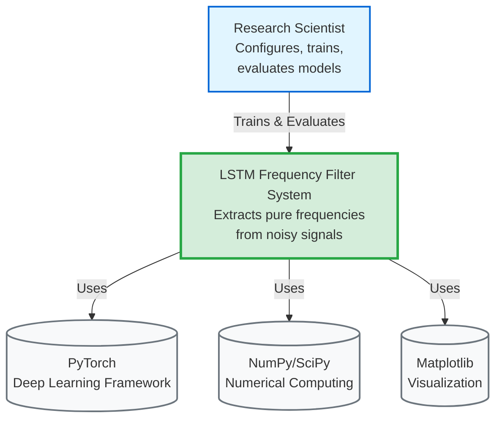
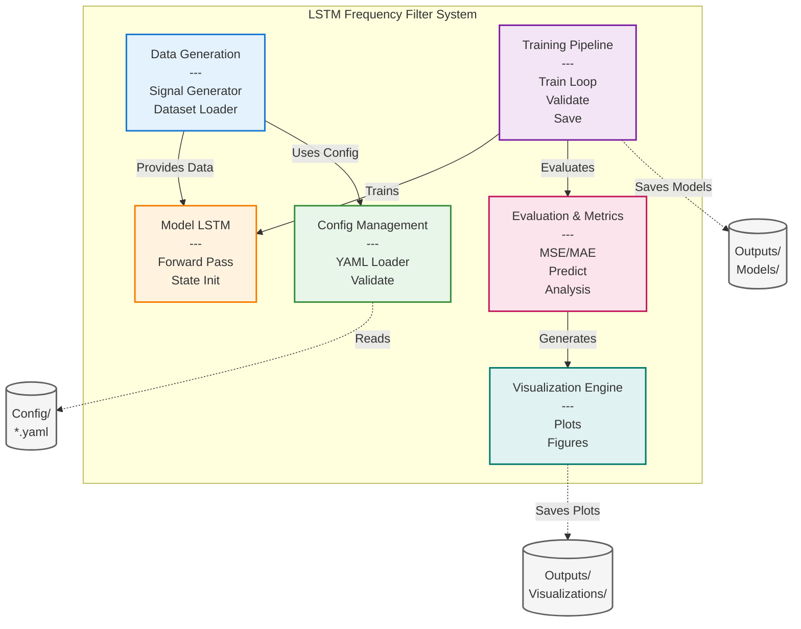
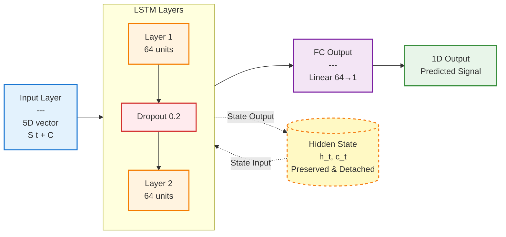
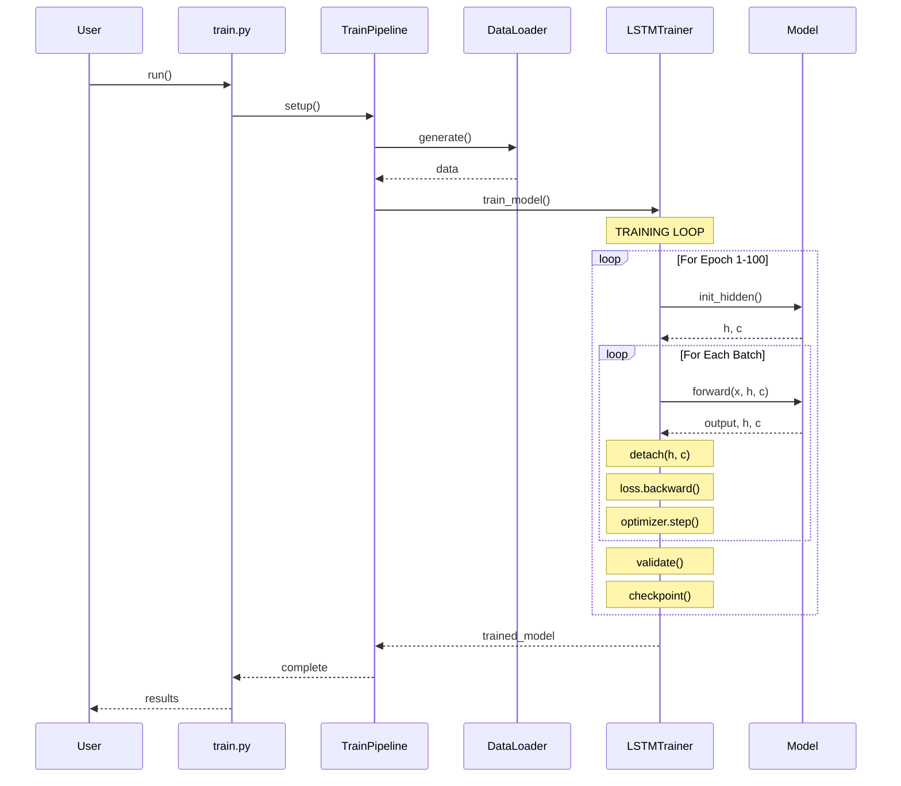
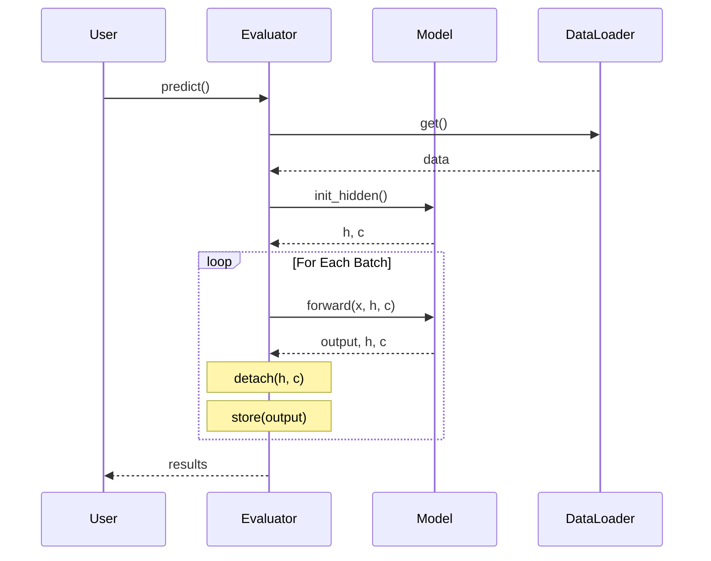
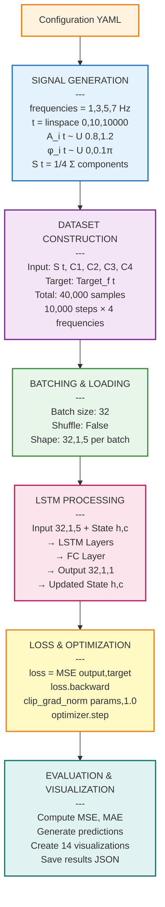

# Architecture Documentation
# LSTM Frequency Filter System

**Version:** 1.0  
**Last Updated:** November 11, 2025

---

## Table of Contents
1. [System Overview](#1-system-overview)
2. [C4 Model Diagrams](#2-c4-model-diagrams)
3. [Component Architecture](#3-component-architecture)
4. [Operational Architecture](#4-operational-architecture)
5. [Data Flow](#5-data-flow)
6. [State Management](#6-state-management)
7. [API Documentation](#7-api-documentation)

---

## 1. System Overview

The LSTM Frequency Filter is a deep learning system that extracts pure sinusoidal frequency components from mixed noisy signals using conditional regression with LSTM neural networks.

### 1.1 Key Characteristics
- **Architecture Pattern:** Pipeline with modular components
- **Processing Model:** Sequential time series processing with state preservation
- **Learning Paradigm:** Supervised learning (regression)
- **Deployment Model:** Standalone Python application

---

## 2. C4 Model Diagrams

### 2.1 Level 1: System Context Diagram



**External Dependencies:**
- **PyTorch**: Deep Learning Framework for neural network implementation
- **NumPy/SciPy**: Numerical computing and signal processing
- **Matplotlib**: Visualization and plotting

### 2.2 Level 2: Container Diagram



**Storage Components:**
- **Config Directory**: YAML configuration files (default.yaml, experiment.yaml)
- **Models Directory**: Trained model checkpoints (.pth files)
- **Visualizations Directory**: Generated plots and figures (.png files)

### 2.3 Level 3: Component Diagram (LSTM Model)



**Architecture Details:**
- **Input**: 5-dimensional vector [S(t), C₁, C₂, C₃, C₄]
- **LSTM Layers**: 2 layers with 64 hidden units each, dropout 0.2
- **Output**: Fully connected layer (64→1) for single value prediction
- **State Management**: Hidden state (h_t, c_t) preserved and detached between batches

---

## 3. Component Architecture

### 3.1 Data Generation Layer

**Location:** `src/data/`

#### SignalGenerator
```
Purpose: Generate synthetic noisy signals and pure targets
Inputs: frequencies, time_range, num_samples, seed
Outputs: S(t), targets, one_hot vectors
Key Methods:
  - generate_noisy_signal(): Creates mixed signal with per-sample noise
  - generate_pure_targets(): Creates ground truth sinusoids
  - generate_dataset(): Complete dataset with one-hot encoding
```

#### Dataset & DataLoader
```
Purpose: PyTorch-compatible data loading
Inputs: Generated signals and targets
Outputs: Batched tensors for training
Key Features:
  - Custom __getitem__ for sequential access
  - Batch size control
  - Shuffle control (critical: False for L=1)
```

### 3.2 Model Layer

**Location:** `src/models/`

#### LSTMFrequencyFilter
```
Architecture:
  Input:  [batch, seq_len=1, input_size=5]
  LSTM:   2 layers × 64 hidden units, dropout=0.2
  FC:     Linear(64 → 1)
  Output: [batch, seq_len=1, output_size=1]

State Management:
  - init_hidden(): Initialize (h_0, c_0) with zeros
  - forward(): Pass with state preservation
  - State detachment: Prevents gradient explosion

Parameters: ~50K total
```

### 3.3 Training Layer

**Location:** `src/training/`

#### LSTMTrainer
```
Responsibilities:
  - Training epoch execution
  - Validation evaluation
  - Checkpoint management
  - Loss tracking

Critical Implementation:
  - State preservation across batches
  - Gradient detachment after each batch
  - Gradient clipping (max_norm=1.0)
  - Learning rate: 0.001 (Adam optimizer)
```

#### ModelEvaluator
```
Responsibilities:
  - MSE computation on datasets
  - Prediction generation
  - Per-frequency metrics
  
Metrics:
  - Overall MSE, MAE
  - Per-frequency MSE, MAE
  - Generalization gap
```

### 3.4 Visualization Layer

**Location:** `src/visualization/`

#### Plot Modules
- **signal_plots**: Time/frequency domain analysis
- **model_plots**: Training curves, prediction analysis
- **training_plots**: Loss visualization, model diagrams
- **prediction_plots**: Error analysis, scatter plots
- **frequency_plots**: FFT comparison, per-frequency metrics

### 3.5 Pipeline Layer

**Location:** `src/pipeline/`

#### TrainPipeline
```
Orchestrates:
  1. Dataset generation
  2. DataLoader creation
  3. Model instantiation
  4. Training execution
  5. Checkpoint saving
```

#### VisualizationPipeline
```
Generates:
  - 14 publication-quality visualizations
  - Complete analysis suite
  - Results summary JSON
```

### 3.6 Configuration Layer

**Location:** `src/config/`

#### ConfigLoader
```
Responsibilities:
  - Load YAML configurations
  - Validate parameters
  - Merge configs (default + custom)
  - Environment variable resolution
```

---

## 4. Operational Architecture

### 4.1 Training Flow (Sequence Diagram)



### 4.2 Prediction Flow (Sequence Diagram)



### 4.3 Runtime Behavior

#### State Preservation Strategy
```
Epoch Start:
  h, c = init_hidden(batch_size)  # Zero initialization

For each batch in epoch:
  # Forward pass WITH previous state
  output, (h, c) = model(input, (h, c))
  
  # CRITICAL: Detach to prevent backprop through history
  h = h.detach()
  c = c.detach()
  
  # Backprop only through current batch
  loss.backward()
  optimizer.step()

Epoch End:
  # State discarded, fresh start next epoch
```

#### Why Detach?
- **Without detach:** Backprop through entire sequence → memory explosion
- **With detach:** Backprop only through current batch → manageable memory
- **Preserves values:** State information carried forward for temporal learning

---

## 5. Data Flow

### 5.1 End-to-End Data Pipeline



### 5.2 Data Shapes Throughout Pipeline

| Stage | Shape | Description |
|-------|-------|-------------|
| Raw signal S(t) | [10000] | Time series |
| Pure targets | [4, 10000] | 4 frequencies × time |
| Expanded S | [40000] | Repeated for each freq |
| Flat targets | [40000] | Flattened targets |
| One-hot vectors | [40000, 4] | Frequency selectors |
| Batch input | [32, 1, 5] | Batch × seq_len × features |
| LSTM hidden h | [2, 32, 64] | Layers × batch × hidden |
| LSTM cell c | [2, 32, 64] | Layers × batch × hidden |
| LSTM output | [32, 1, 64] | Batch × seq × hidden |
| Final output | [32, 1, 1] | Batch × seq × output |
| Squeezed output | [32, 1] | For loss computation |

---

## 6. State Management

### 6.1 LSTM Hidden State Architecture

```
Hidden State Structure:
┌─────────────────────────────────────────┐
│         h (Hidden State)                │
│  Shape: [num_layers, batch, hidden]     │
│         [2, 32, 64]                     │
│                                         │
│  Layer 2: [32 × 64] ← Output features   │
│  Layer 1: [32 × 64] ← Internal features │
└─────────────────────────────────────────┘

┌─────────────────────────────────────────┐
│         c (Cell State)                  │
│  Shape: [num_layers, batch, hidden]     │
│         [2, 32, 64]                     │
│                                         │
│  Layer 2: [32 × 64] ← Long-term memory  │
│  Layer 1: [32 × 64] ← Long-term memory  │
└─────────────────────────────────────────┘
```

### 6.2 State Lifecycle

```
┌─────────────┐
│   Epoch 1   │
├─────────────┤
│ h,c = zeros │──┐
│             │  │
│  Batch 1    │  │ State flows through batches
│  Batch 2    │◀─┤ Values preserved
│  Batch 3    │──┤ Gradients detached
│  ...        │  │
│  Batch N    │◀─┘
└─────────────┘

┌─────────────┐
│   Epoch 2   │
├─────────────┤
│ h,c = zeros │──┐  Fresh start each epoch
│             │  │
│  Batch 1    │  │
│  ...        │  │
└─────────────┘
```

---

## 7. API Documentation

### 7.1 Public Interfaces

#### Signal Generation API
```python
class SignalGenerator:
    def __init__(frequencies, time_range, num_samples, seed)
    def generate_noisy_signal() -> np.ndarray
    def generate_pure_targets() -> np.ndarray
    def generate_dataset() -> Tuple[np.ndarray, np.ndarray, np.ndarray]
    def get_time_array() -> np.ndarray

# Factory Function
def create_train_test_datasets(train_seed, test_seed) -> Tuple[...]
```

#### Model API
```python
class LSTMFrequencyFilter(nn.Module):
    def __init__(input_size, hidden_size, num_layers, output_size, dropout)
    def forward(x, hidden) -> Tuple[Tensor, Tuple[Tensor, Tensor]]
    def init_hidden(batch_size, device) -> Tuple[Tensor, Tensor]
    def predict(x, hidden) -> Tuple[Tensor, Tuple[Tensor, Tensor]]

# Factory Functions
def create_model(...) -> LSTMFrequencyFilter
def save_model(model, filepath, epoch, optimizer_state)
def load_model(filepath, device) -> Tuple[Model, int]
```

#### Training API
```python
class LSTMTrainer:
    def __init__(model, device, learning_rate, weight_decay)
    def train_epoch(train_loader, reset_state_each_batch) -> float
    def validate(val_loader) -> float
    def train(train_loader, val_loader, num_epochs, ...) -> Dict
    def save_checkpoint(filepath, epoch)
    def load_checkpoint(filepath) -> int
```

#### Evaluation API
```python
class ModelEvaluator:
    def __init__(model, device)
    def compute_mse(data_loader) -> float
    def generate_predictions(data_loader) -> Tuple[np.ndarray, np.ndarray]
    def evaluate_per_frequency(data_loader, num_frequencies) -> Dict

# Utility Function
def evaluate_model(model, train_loader, test_loader, device) -> Dict
```

#### Configuration API
```python
class ConfigLoader:
    def load_config(config_path) -> Dict
    def validate_config(config) -> bool
    def merge_configs(default, custom) -> Dict
    def get_param(key, default) -> Any
```

### 7.2 Extension Points

#### Custom Signal Generator
```python
class CustomSignalGenerator(SignalGenerator):
    """Extend for different noise models or frequencies"""
    def generate_noisy_signal(self) -> np.ndarray:
        # Override with custom noise implementation
        pass
```

#### Custom Loss Function
```python
def custom_loss_function(output, target):
    """Can replace MSE with custom loss"""
    return loss_value
```

#### Custom Visualization
```python
def plot_custom_analysis(data, save_path):
    """Add to visualization pipeline"""
    pass
```

---

## 8. Design Patterns Used

### 8.1 Architectural Patterns
- **Pipeline Pattern:** Sequential data processing stages
- **Factory Pattern:** Model and dataset creation functions
- **Strategy Pattern:** Pluggable loss functions and generators
- **Observer Pattern:** Training callbacks for checkpoints and logging

### 8.2 Code Organization Patterns
- **Separation of Concerns:** Each module has single responsibility
- **Dependency Injection:** Device, config passed to components
- **Facade Pattern:** High-level APIs hide complexity
- **Template Method:** Training loop with customizable steps

---

## 9. Performance Considerations

### 9.1 Memory Management
- **Gradient Detachment:** Prevents memory accumulation
- **Batch Processing:** Controlled memory footprint
- **State Reinitialization:** Fresh state each epoch saves memory

### 9.2 Computational Efficiency
- **L=1 Trade-off:** Pedagogical clarity vs computational efficiency
- **GPU Acceleration:** Optional CUDA support for faster training
- **Gradient Clipping:** Prevents numerical instability

---

## 10. Security & Reliability

### 10.1 Input Validation
- Configuration parameters validated on load
- Dataset shapes verified before training
- Device availability checked before allocation

### 10.2 Error Handling
- Graceful handling of mismatched batch sizes
- Checkpoint recovery on training interruption
- Clear error messages for common issues

---

*This architecture supports a robust, maintainable, and extensible LSTM-based signal processing system designed for both educational and research purposes.*

